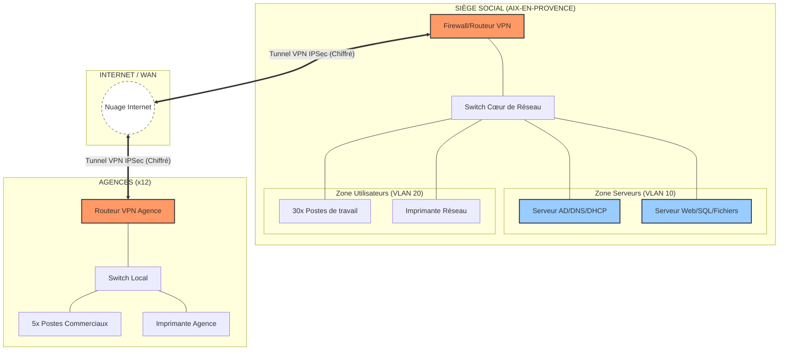

# Schéma d'Architecture Réseau - Projet Ymmo

Ce schéma représente la topologie **Hub & Spoke** sécurisée entre le siège social (Aix) et les agences distantes.

## 1. Schéma Visuel (Mermaid)

## 2. Légende technique
*   **Ligne Double (==) :** Tunnel VPN IPSec sécurisé.
*   **Ligne Simple (--) :** Connexion Ethernet LAN (GigaBit).
*   **Firewall :** Gère la sécurité périmétrique et le routage inter-VLAN.
*   **Serveurs :** Centralisés au siège pour faciliter la maintenance et les sauvegardes.

---
*Document généré pour la partie Architecture - Robin*
